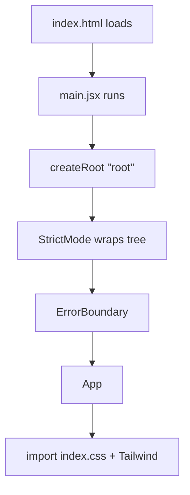
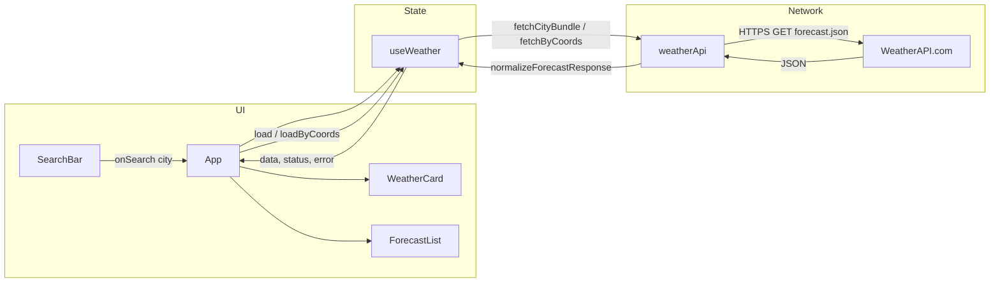

# SkyCast — End-to-End Workflow & Interview Guide

This document explains **how the app works from first load to every user action**, so you can walk interviewers through **architecture, data flow, and design decisions** clearly.

---

## 1. What this app is (elevator pitch)

**SkyCast** is a React (Vite) single-page app that shows **current weather** and a **multi-day forecast** using the **WeatherAPI.com** HTTP API. It supports **city search**, **browser geolocation**, **metric/imperial units**, **recent searches** (saved in the browser), **dynamic backgrounds** driven by condition codes, and **error handling** (API errors + a React error boundary).

---

## 2. Tech stack (what to say in one breath)

| Layer | Choice | Why it matters |
|--------|--------|----------------|
| UI | React 19 + hooks | Component model, `useState` / `useEffect` / custom hooks |
| Build | Vite | Fast dev server, optimized production bundle |
| Styling | Tailwind CSS | Utility-first, responsive, consistent design tokens |
| HTTP | Axios | One configured client, shared error handling |
| API | [WeatherAPI.com](https://www.weatherapi.com/) | One `forecast.json` call returns **current + forecast** |
| Config | `import.meta.env` (Vite) | API key via `VITE_WEATHER_API_KEY` — never hardcoded |

---

## 3. Folder structure (mental map)

```
src/
  main.jsx           → App entry: React root + ErrorBoundary + App
  App.jsx            → Page layout, background, header, wires hooks → components
  components/        → Presentational UI (SearchBar, WeatherCard, Forecast*, Loader, etc.)
  hooks/
    useWeather.js    → Fetch state machine: idle | loading | success | error
    useLocalStorage.js → Recent cities persisted in localStorage
  services/
    weatherApi.js    → Axios calls + normalize API JSON → app-friendly objects
  utils/
    backgrounds.js   → Gradient + photo per “mood”
    weatherCondition.js → Map WeatherAPI condition code → clear / clouds / rain / snow
    formatters.js    → Dates, temps, wind strings
```

**Interview line:** *“I separated API and normalization in `services`, UI state in `hooks`, and pure helpers in `utils`, so components stay mostly declarative.”*

---

## 4. Application bootstrap (first paint)



1. **HTML** has a single `<div id="root">`.
2. **`main.jsx`** mounts React with `createRoot`, wraps **`ErrorBoundary`** around **`App`** so uncaught render errors show a fallback UI instead of a white screen.
3. **`App.jsx`** renders the shell (gradient + optional photo layers, header, search, content).

---

## 5. Core data flow (the heart of the app)



### What `useWeather` owns

| State | Meaning |
|--------|--------|
| `city` | Resolved location name from the last successful response |
| `units` | `"metric"` or `"imperial"` |
| `data` | `{ current, forecast: { days: [] } }` — **normalized**, not raw API |
| `status` | `"idle"` → `"loading"` → `"success"` or `"error"` |
| `error` | User-facing string when the request fails |

### Functions it exposes

- **`load(city, units)`** — search by name (or query string WeatherAPI accepts).
- **`loadByCoords(lat, lon, units)`** — same API, but `q` is `"lat,lon"`.

On **mount**, a `useEffect` runs **`fetchInitialBundle(defaultUnits)`** once: it tries **`VITE_DEFAULT_LOCATION`** or **`Lahore`** by default, then **`VITE_FALLBACK_LOCATION`** (default `auto:ip`) if the primary fails, so the first paint shows real data without typing.

**Interview line:** *“The hook is a small state machine: loading clears the error, success stores normalized data, error stores a message from a single `getWeatherErrorMessage` helper.”*

---

## 6. API layer — one request, two concerns solved

The app does **not** call separate “current” and “forecast” endpoints. It uses:

```http
GET https://api.weatherapi.com/v1/forecast.json?key=...&q=...&days=...&aqi=no&alerts=no
```

- **`q`**: city name **or** `lat,lon` for geolocation.
- **`days`**: from `VITE_FORECAST_DAYS` or default **3** (often matches free-tier limits; increase if your plan allows).
- **`key`**: from **`VITE_WEATHER_API_KEY`** in `.env` (Vite only exposes vars prefixed with `VITE_`).

**`normalizeForecastResponse`** in `weatherApi.js`:

- Picks `temp_c` vs `temp_f`, `wind_kph` vs `wind_mph`, etc., based on `units`.
- Fixes icon URLs (`//cdn...` → `https:...`).
- Builds **`forecast.days`** — one object per day with high/low, rain chance, condition text/icon.

**Interview line:** *“I normalize the API once so components don’t depend on WeatherAPI’s field names, which makes testing and swapping providers easier.”*

---

## 7. User journeys (step-by-step)

### A. Open the app

1. `useWeather` runs initial `fetchInitialBundle("metric")` — `Lahore` or a configured `VITE_DEFAULT_LOCATION`, with `auto:ip` fallback.
2. `status` → `loading` → `Loader` shows.
3. On success: `WeatherCard` + `ForecastList` render from `data`.
4. `pickBackground(conditionCode, isDay)` sets gradient + optional stock photo.

### B. Search a city

1. User submits **`SearchBar`** form → `onSearch(city)` → `App` calls **`load(city, units)`**.
2. Recent cities: **`useLocalStorage`** prepends the city and keeps the last 5.
3. Same loading/success/error path as above.

### C. “My location”

1. **`navigator.geolocation.getCurrentPosition`** returns `lat` / `lon`.
2. **`loadByCoords(lat, lon, units)`** → API `q=lat,lon`.
3. Resolved **`city`** updates to the API’s location name.

### D. Toggle Metric / Imperial

1. **`Toggle`** calls **`load(city, nextUnits)`** — not just local state — so **temperatures and wind values** match the newly requested units from the API.

---

## 8. UI pieces (what each part is responsible for)

| Component | Role |
|-----------|------|
| **SearchBar** | Controlled flow: form submit → parent handles API; optional **recent** chips |
| **WeatherCard** | Shows normalized **current** block: time in location TZ, wind + gust + direction, UV, pressure |
| **ForecastList / ForecastItem** | One card per forecast day: high, low, rain %, icon |
| **Loader** | Shown when `status === "loading"` |
| **ErrorBanner** | Shown when `status === "error"` |
| **ErrorBoundary** | Catches **React** errors (bugs), not failed HTTP — different from API errors |

**Performance polish:** background blurs are tuned lighter, and `prefers-reduced-motion` disables animations and transitions to keep lower-end devices smooth.

---

## 9. Dynamic background (how “mood” is chosen)

1. From **`data.current`**: `conditionCode` (WeatherAPI) and **`isDay`** (boolean).
2. **`categoryFromWeatherApiCode`** maps code → `clear` / `clouds` / `rain` / `snow` (day).
3. If **night** (`isDay === false`), use the **night** preset.
4. **`backgrounds.js`** maps each category to a **Tailwind gradient** + optional **full-bleed image** + overlay for readability.

**Interview line:** *“Visual state is derived from the same condition metadata we already use for copy and icons, so it stays in sync with the API.”*

---

## 10. Error handling (two layers)

| Layer | What fails | What the user sees |
|--------|------------|---------------------|
| **Axios / API** | 4xx/5xx, timeout, `{ error: { message } }` | **`getWeatherErrorMessage`** → **ErrorBanner** |
| **ErrorBoundary** | Throw during render (bug) | Fallback screen + reload |

---

## 11. Security & production notes (good talking points)

- **Secrets:** API key only in **`.env`**, referenced as **`import.meta.env.VITE_WEATHER_API_KEY`**. Never commit `.env`.
- **Client-side key:** Any `VITE_*` variable is **bundled into the browser** — acceptable for many public weather APIs; for highly sensitive keys you’d use a **backend proxy** (out of scope here).
- **Build:** `npm run build` — env vars are **inlined at build time**; change env on the host → **rebuild/redeploy**.

---

## 12. Build & deploy (short)

1. `npm run build` → output in **`dist/`**.
2. Host on **Netlify / Vercel** (static SPA).
3. Set **`VITE_WEATHER_API_KEY`** (and optionally **`VITE_FORECAST_DAYS`**) in the platform’s environment settings.

---

## 13. Suggested interview talking points (bullet cheat sheet)

- **Why Vite:** fast HMR, first-class ESM, simple env handling.
- **Why a custom hook:** encapsulates async + loading + error + units in one place; `App` stays readable.
- **Why normalize API responses:** UI components depend on a **stable shape**, not vendor JSON.
- **Why one forecast endpoint:** fewer round-trips, simpler sync between “now” and “next days.”
- **Why ErrorBoundary:** separates **network failures** from **rendering bugs**.
- **Why localStorage for recents:** cheap UX win without a backend.

---

## 14. One-sentence summary for closing

*“Users interact with a thin React shell; a custom **`useWeather`** hook drives a **state machine** that calls a **single WeatherAPI forecast endpoint**, **normalizes** the JSON, and feeds **presentational components**, while **backgrounds** and **recent searches** add polish on top of that core loop.”*

---

You can open this file before interviews and walk sections **4 → 7 → 8** for the main story, then **10–11** if they ask about errors and deployment.
